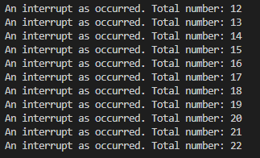

# Practica 2B

En esta practica utilizaremos las interrupciones mediante temporizadores 

**Código**
```cpp
#include <Arduino.h>

volatile int interruptCounter;
int totalInterruptCounter;
 
hw_timer_t * timer = NULL;
portMUX_TYPE timerMux = portMUX_INITIALIZER_UNLOCKED;
 
void IRAM_ATTR onTimer() {
  portENTER_CRITICAL_ISR(&timerMux);
  interruptCounter++;
  portEXIT_CRITICAL_ISR(&timerMux);
 
}
 
void setup() {
 
  Serial.begin(115200);
 
  timer = timerBegin(0, 80, true);
  timerAttachInterrupt(timer, &onTimer, true);
  timerAlarmWrite(timer, 1000000, true);
  timerAlarmEnable(timer);
 
}
 
void loop() {
 
  if (interruptCounter > 0) {
 
    portENTER_CRITICAL(&timerMux);
    interruptCounter--;
    portEXIT_CRITICAL(&timerMux);
 
    totalInterruptCounter++;
 
    Serial.print("An interrupt as occurred. Total number: ");
    Serial.println(totalInterruptCounter);
 
  }
}
```
**Declaraciones**

```cpp

volatile int interruptCounter;
int totalInterruptCounter;
 
hw_timer_t * timer = NULL;
portMUX_TYPE timerMux = portMUX_INITIALIZER_UNLOCKED;
 
void IRAM_ATTR onTimer() {
  portENTER_CRITICAL_ISR(&timerMux);
  interruptCounter++;
  portEXIT_CRITICAL_ISR(&timerMux);
 
}
```
En esta parte del codigo delararemos las variable necesarias para porder ejecutar u timer que activara la interrupcion, tmabien declararemos la interrupcion

**SETUP**
```cpp
void setup() {
 
  Serial.begin(115200);
 
  timer = timerBegin(0, 80, true);
  timerAttachInterrupt(timer, &onTimer, true);
  timerAlarmWrite(timer, 1000000, true);
  timerAlarmEnable(timer);
 
}
```
En el setup inicializamos el Serial ,configuramos el timer y finalmente asignamos los valores a la interrupción 

**Loop**

```cpp
void loop() {
 
  if (interruptCounter > 0) {
 
    portENTER_CRITICAL(&timerMux);
    interruptCounter--;
    portEXIT_CRITICAL(&timerMux);
 
    totalInterruptCounter++;
 
    Serial.print("An interrupt as occurred. Total number: ");
    Serial.println(totalInterruptCounter);
 
  }
}
```

En el main loop ejecutaremos la interrupcion y mostraremos por el serial cuantas veces se ha ejecutado esta interrupcion 



